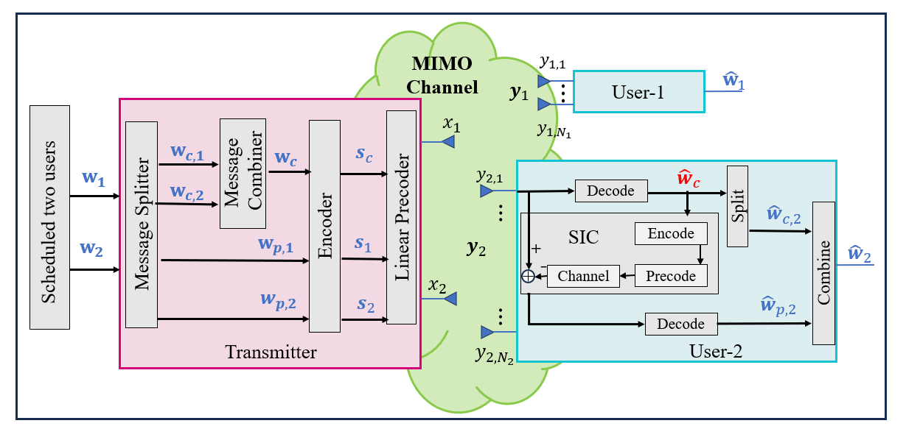
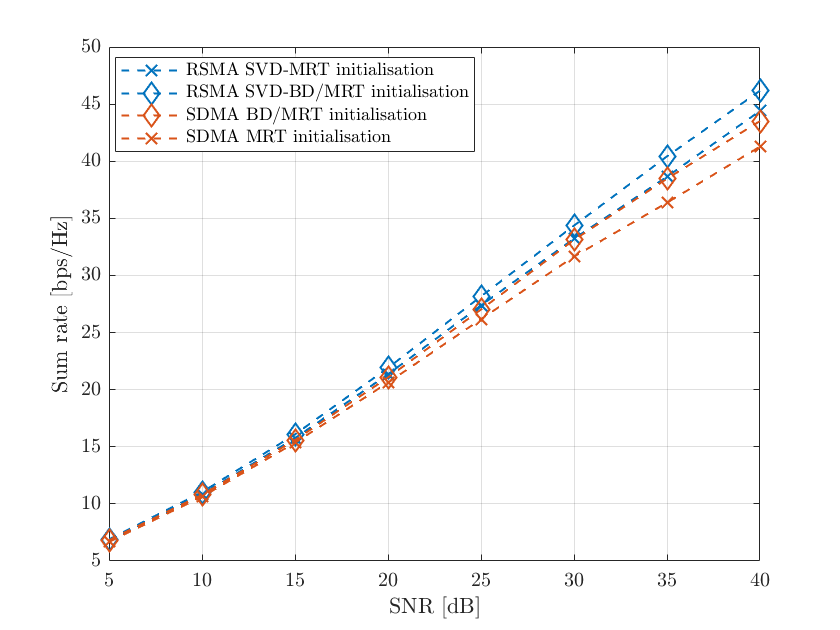
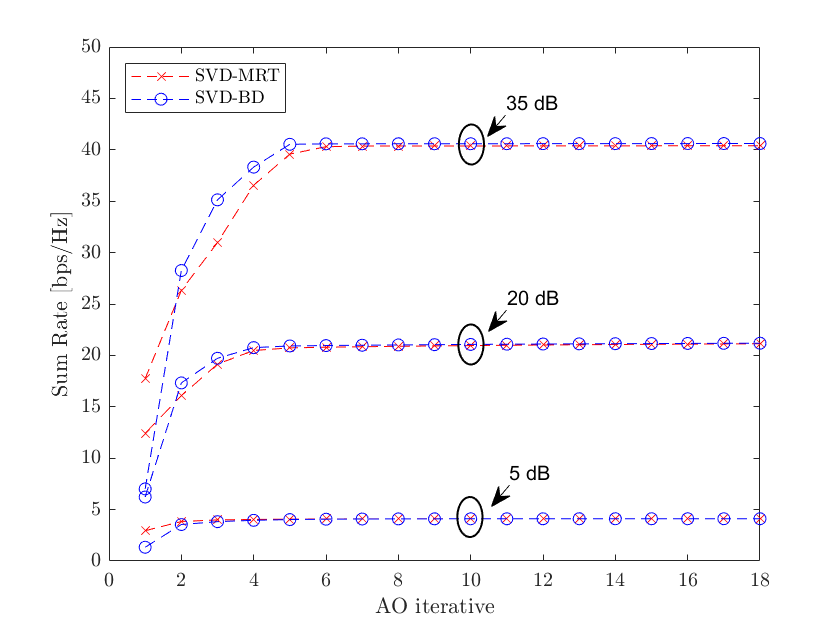
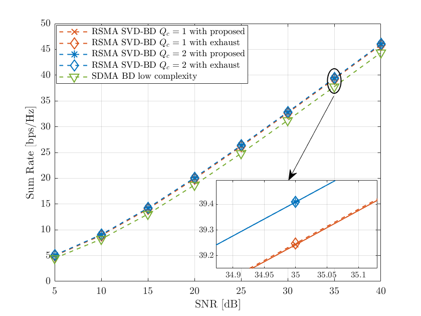
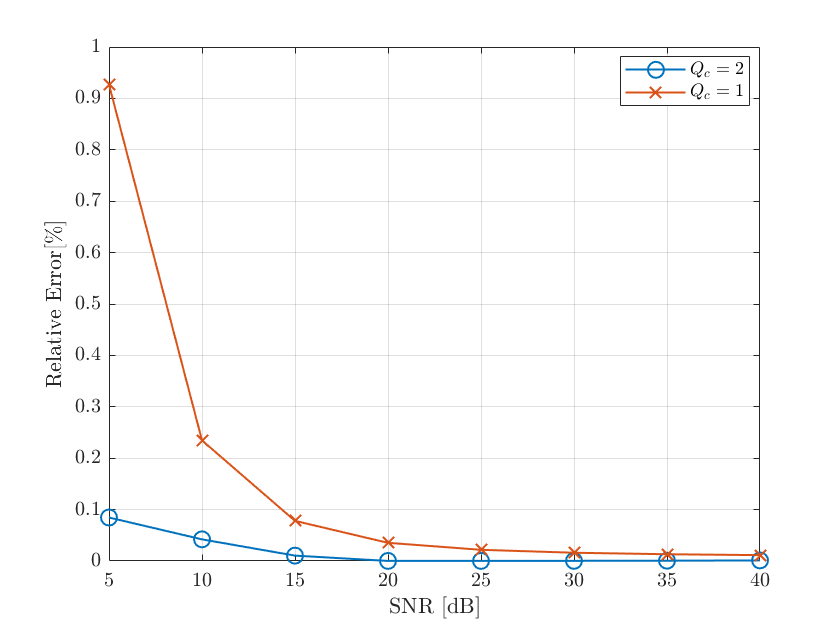
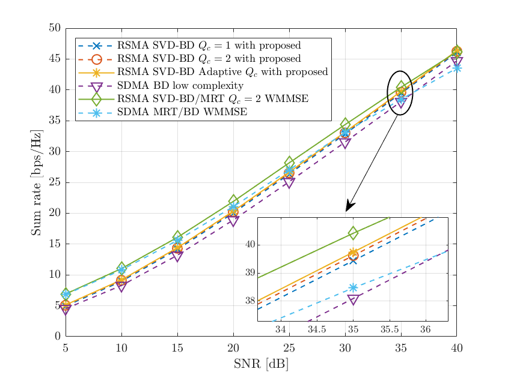
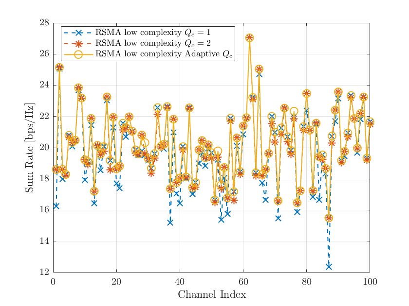
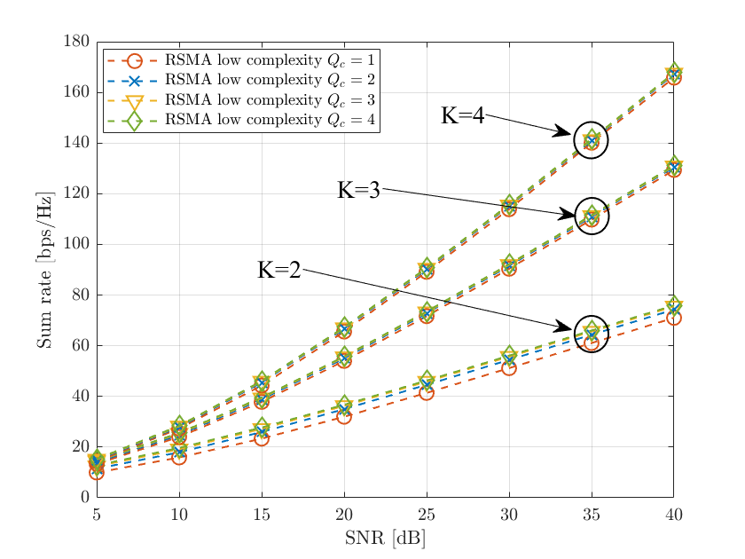

# Low-Complexity Precoder Design for RSMA

This repository contains the MATLAB simulations and result figures for an MSc project at Imperial College London, Department of Electrical and Electronic Engineering, Communication and Signal Processing MSc 2023-2024.

The project studies **Rate-Splitting Multiple Access (RSMA)** for downlink multi-user MIMO systems. It compares conventional WMMSE-style optimization with a lower-complexity design based on block diagonalization (BD), adaptive common-stream selection, and closed-form / Newton-Raphson power allocation.



## Project Goals

- Compare RSMA and SDMA sum-rate performance across SNR values.
- Reduce the computational burden of RSMA precoder design.
- Study how common-stream number `Qc` affects sum rate, approximation error, and scalability.
- Benchmark the proposed low-complexity method against exhaustive search and WMMSE baselines.
- Visualize common/private precoder power allocation across channel realizations.

## Repository Structure

```text
.
|-- README.md
|-- docs/
|   `-- superpowers/plans/
|-- experiments/
|   |-- figure-4.1-snr-initialisation/
|   |-- figure-4.2-ao-convergence/
|   |-- figures-4.3-4.4-4.6-low-complexity/
|   |-- figure-4.7-adaptive-common-streams/
|   |-- figures-4.8-4.9-power-distribution/
|   `-- figure-4.10-large-scale-comparison/
`-- figures/
```

| Folder | Purpose | Main entry points |
| --- | --- | --- |
| [`experiments/figure-4.1-snr-initialisation`](experiments/figure-4.1-snr-initialisation) | RSMA/SDMA sum-rate comparison with MRT, BD, and SVD-based initialization. | `main.m`, `figure4_1_main.m` |
| [`experiments/figure-4.2-ao-convergence`](experiments/figure-4.2-ao-convergence) | Alternating-optimization convergence comparison for MRT and BD initialization. | `main2.m`, `main_plot2.m` |
| [`experiments/figures-4.3-4.4-4.6-low-complexity`](experiments/figures-4.3-4.4-4.6-low-complexity) | Proposed low-complexity RSMA method, exhaustive-search comparison, relative error, and channel-index behavior. | `main3.m`, `user2_2Nk_4Nt_main.m` |
| [`experiments/figure-4.7-adaptive-common-streams`](experiments/figure-4.7-adaptive-common-streams) | Adaptive common-stream selection for larger user/antenna settings. | `main3.m`, `plot_main.m` |
| [`experiments/figures-4.8-4.9-power-distribution`](experiments/figures-4.8-4.9-power-distribution) | Common and private precoder power distribution analysis. | `data_main.m` |
| [`experiments/figure-4.10-large-scale-comparison`](experiments/figure-4.10-large-scale-comparison) | Large-scale comparison between adaptive RSMA, SDMA BD, and WMMSE baselines. | `main_plot3_MRT.m` |
| [`figures`](figures) | Rendered result images used by this README and the project report. | PNG outputs |

## Method Overview

RSMA splits each user's message into common and private parts. The common streams are decoded by multiple users, while private streams are decoded individually. This can improve robustness and sum rate compared with SDMA when users experience interference.

The low-complexity design in this project follows this flow:

1. Generate Rayleigh fading MIMO channel realizations.
2. Construct SDMA / RSMA private precoders using block diagonalization.
3. Allocate common-stream power using Newton-Raphson optimization.
4. Evaluate candidate common-stream counts `Qc`.
5. Select the best `Qc` adaptively or compare against exhaustive search.
6. Compare RSMA against SDMA and WMMSE-based optimization baselines.

## Key Results

### Sum-Rate Comparison

Figure 4.1 compares RSMA and SDMA under different initialization strategies. The result highlights the benefit of RSMA and the importance of stronger initialization for high-SNR performance.



### AO Convergence

Figure 4.2 compares alternating-optimization convergence under MRT and BD initialization across different SNR levels.



### Low-Complexity RSMA Approximation

Figures 4.3 and 4.4 compare the proposed low-complexity design with exhaustive search and report the relative error for different numbers of common streams.





### Adaptive Common-Stream Selection

The project studies how the number of common streams affects performance and uses adaptive selection to retain most of the exhaustive-search gain with lower complexity.





### Power Distribution

Figures 4.7-4.9 visualize how power is distributed across common and private streams under different SNR values and channel realizations.


### Large-Scale Comparison

Figure 4.10 compares adaptive RSMA, SDMA BD, and WMMSE baselines in a larger antenna setting.



## How to Reproduce

The scripts are written for MATLAB. Some WMMSE optimization routines use CVX-style convex optimization syntax, so install CVX before running the optimization-heavy experiments.

Recommended workflow:

1. Open MATLAB.
2. Change directory into one experiment folder, for example:

   ```matlab
   cd experiments/figure-4.1-snr-initialisation
   ```

3. Run the main script for that experiment:

   ```matlab
   main
   ```

4. For faster plotting from saved data, use the plot-only scripts where available:

   ```matlab
   figure4_1_main
   main_plot2
   main_plot3_MRT
   ```

The `.mat` files store precomputed simulation results. Re-running full Monte Carlo simulations can take significant time for the larger experiments.

## Main MATLAB Components

- `BD_design.m`: block diagonalization precoder construction.
- `adaptive_common_stream.m`: evaluates RSMA common-stream allocation.
- `netwon_raphson_method*.m`: Newton-Raphson power-splitting routines.
- `RSMA_BD_rate.m` and `RSMA_BD_MRC_rate.m`: RSMA rate evaluation.
- `SDMA_BD_ZF.m`: SDMA baseline with BD/ZF-style design.
- `RSMA_exhaust_search*.m`: exhaustive-search references.
- `RSMA_MIMO_*` and `SDMA_MIMO_*`: WMMSE-style optimization utilities used in the comparison experiments.

## Academic Context

This work builds on RSMA and WMMSE precoder optimization literature, especially downlink multi-user MIMO RSMA designs. Several MATLAB function headers refer to:

> Rate-Splitting Multiple Access for Downlink Multiuser MIMO: Precoder Optimization and PHY-Layer Design, by Anup Mishra, Yijie Mao, Onur Dizdar, and Bruno Clerckx.

## Author

Claudio Dong  
Imperial College London  
Communication and Signal Processing MSc, 2023-2024
